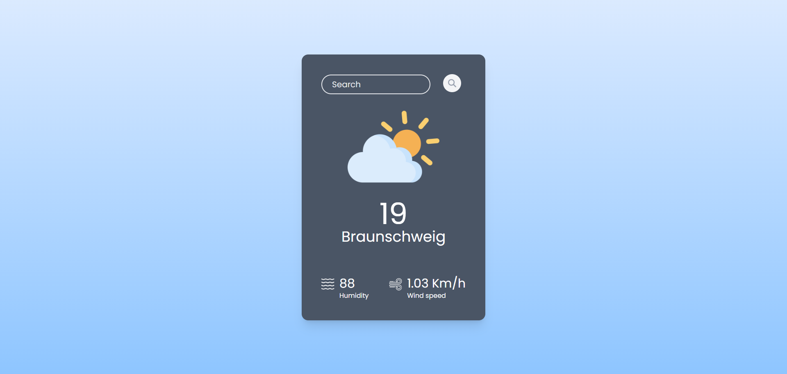

# Weather App

This is a simple React app that fetches and displays real-time weather data for a given city.
<br>



## Technologies Used

<ul>
<li>React</li>
<li>OpenWeatherMap API</li>
<li>Tailwind CSS</li>
<li>Vite</li>
</ul>

## How to Use

Follow these steps to test the project locally on your machine:

1. Clone the repository or download this project folder

1. Install [Node.js](https://nodejs.org/en) if not installed

1. Navigate into the project folder and install dependencies:

   ```bash
   npm install
   ```

1. Start the development server:
   ```bash
   npm run dev
   ```
