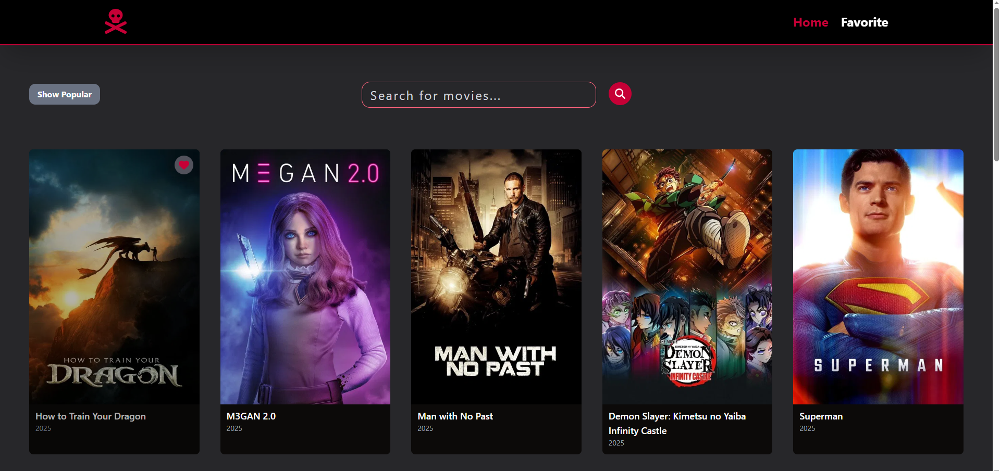

# Favorite Movies Web

This web application fetches and displays trending movies from the TMDb API. It also supports movie search and lets users manage a favorites list by adding or removing selected movies.

<br>



<br>


## Technologies Used

<ul>
<li>React</li>
<li>TMDb API</li>
<li>Tailwind CSS</li>
<li>Fontawesome</li>
<li>Vite</li>
</ul>

## How to Use

Follow these steps to test the project locally on your machine:

1. Clone the repository or download this project folder

1. Install [Node.js](https://nodejs.org/en) if not installed

1. Navigate into the project folder and install dependencies:

   ```bash
   npm install
   ```

1. Start the development server:
   ```bash
   npm run dev
   ```
