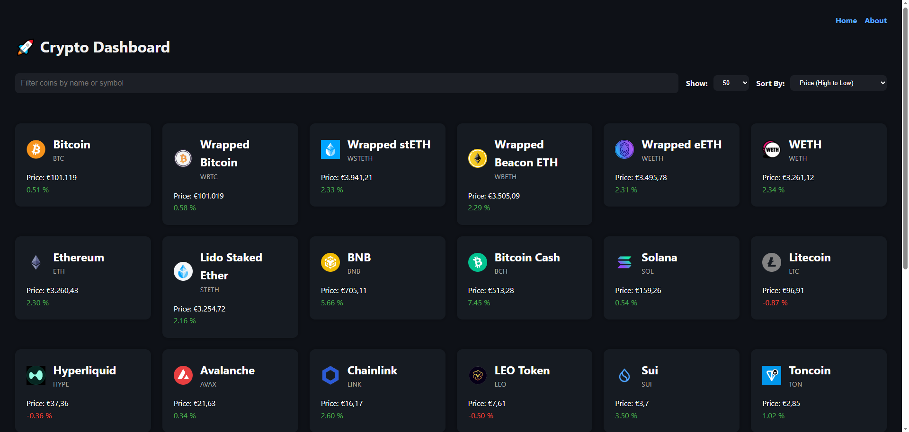
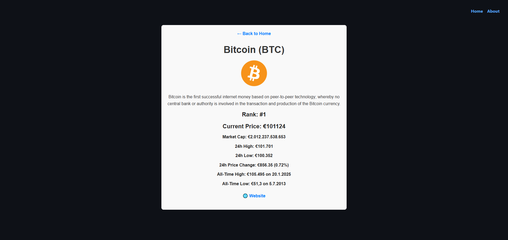

# Crypto Dashboard

This web application displays real-time cryptocurrency market data using the CoinGecko API. Users can view the top-ranked coins, filter coins, and sort them by key metrics such as price or market cap. 

 

 

## Technologies Used

<ul>
<li>React</li>
<li>coingecko API</li>
<li>Vite</li>
</ul>
