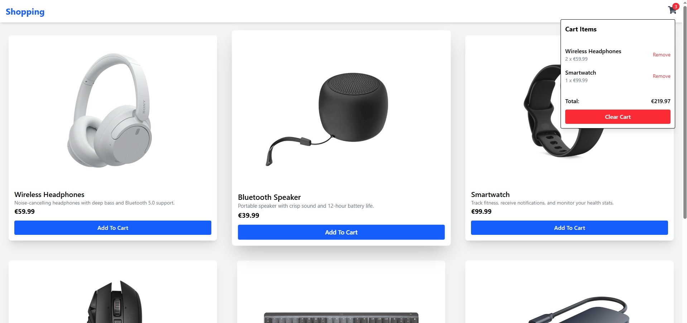

# Shopping Cart UI

Note: In this project you must also start the json server in a second terminal.
   ```bash
   npm run json-server
   ```

##

This is a responsive and interactive shopping cart built with React, Tailwind CSS, and json-server for mock API data. This project allows users to browse products, add/remove items to/from the cart, view quantities, and see the total price update in real-time.

<br>




## Technologies Used

<ul>
<li>React</li>
<li>Json Server</li>
<li>Tailwind CSS</li>
<li>Vite</li>
</ul>
