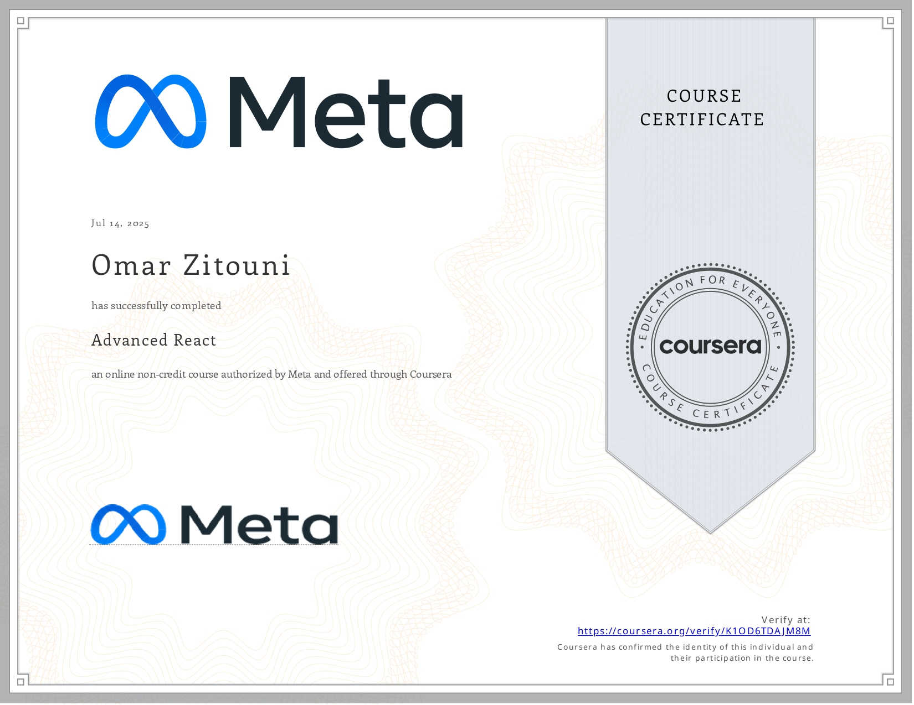

# React Projects
These projects were developed as part of my training after completing the React Basics and Advanced React certification courses offered by Meta on [Coursera](https://www.coursera.org/).


## Certificates




## How to Use

Follow these steps to test any of the projects locally on your machine:

1. Clone the repository or download a project folder

1. Install [Node.js](https://nodejs.org/en) if not installed

1. Navigate into a project folder and install dependencies:

   ```bash
   npm install
   ```

1. Start the development server:
   ```bash
   npm run dev
   ```
